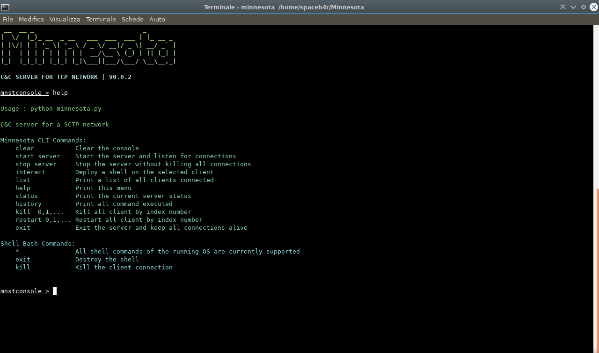
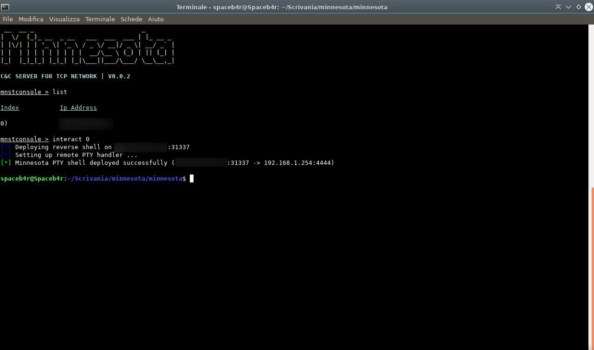

# Minnesota V.0.0.2

## <u>What is</u> ?

Minnesota is a __Open-source__ project born with the intent to offer the best solution to __remote control a cluster__ of machines, this software is created on the project of __Darren 'infodox' Martyn__ ( [python-pty-shells](https://github.com/infodox/python-pty-shells) ) . Usually this kind of operation is performed using other software that doesn't allow a __stable multiclient connection__ at time making the control of more computers chaotic and subject to troubles. Minnesota offers a stable __Command & Control TCP server__ to administrate a cluster without any problem.

## <u>How does it work</u> ?

This software is completly written in __Python 2.7__ and can be executed on any __Linux__ machine and __it doesn't require any external library__ , soon will be implemented the __most stable shell on Windows__ too.
The communication between the C&C and the client is performed via __TCP protocol__ and it exploits __pseudo-terminal__ to deploy a shell for the bot-master.

The main heart of the remote command execution is the following : `pty.spawn(...)` , using this syntax the software will generate a separated __PTY instance__ where the user can works without touching all the others local shells.

[Read More about pseudo terminals](https://en.wikipedia.org/wiki/Pseudoterminal)

## <u>Why Pseudo-Terminal</u> ?

Any kind of other reverse shell written in Python presents a large number of problems about the correct interaction with the remote user. Usually the agent provides to get the remote user command to execute and after launching it in memory it catches the output sending it back to the master; this method is insecure for the stable of the remote shell risking to drop the connection between the agent and the C&C. Minnesota's agent __deploy a PTY shell for the remote user__ in order to use a __completly native CLI to avoid any kind of reject__ by the command execution making the connection __100% stable__.

## <u>Requirements</u>

- Python 2.7

## <u>Pre-Deployment</u>
To set up the C&C correctly it's necessary to modify the `server.conf` file. Replace __HOST__ with the machine server IP , usually this is the LAN ip or just `0.0.0.0` to let the server to listen on every ip address available , of course it'll be necessary a port forwading on the main gateway ; now the user need to declaire the port for the reverse shell connection defined as __RPORT__ ,after that replace the __PORT__ and __MAXCONN__ where the last one means the maximum number of connections that the server will accept. 

Of course these settings must be reflected on the agent so in the file `agent.py` must be modified the IP and the PORT by _server.conf_ file. After that the shell uses by default the port (__RPORT for the C&C__) `31337` and it can be modified in both of files `tcp_pty_shell_handler.py` and `tcp_pty_backconnect.py` such as the Ip address but usually the backconnection hostname is the same .

## <u>Server Deployment</u>

From the __0.0.2__ version as been implemented a setup file to allow a faster and simpler deployment than the __0.0.1__, it's enough build the setup with the following command :

`sudo python setup.py build`

And now to install it :

`sudo python setup.py install`

Now the user is able to run __Minnesota__ as binary from every location on the machine just typing in a cmd :

`minnesota`

## <u>Agent Deployment</u>

To start the Minnesota agent is necessary run the bash script , __DO NOT RUN__ directly the agent.py because when the shell is destroyed by the C&C it will keep the connection closed . 
So to start the agent type this in a terminal inside the project folder :

This to make the bash file executable:

`chmod +x handler.sh` 

And then to start :

`./handler.sh`

## <u>Usage</u>

The usage of Minnesota is pretty simple , thought to be easy to deploy and to use.
Once the C&C shell is on, there are some commands to administrate the server :

__MINNESOTA CLI COMMANDS__

Command | Description
--------|------------
clear | clear the conosole server
exit | exit from the C&C but keep all the clients alive
history | print all the commands executed in the C&C
help | print the help menu
interact _< id >_ | spawn a shell on the machine identified by client id
kill _< id >_,...| kill the client by client id. For more kills separate each id with comma
list | print all connections established with their client id
restart _< id >_,... | restart the agent by client id . For more restart separate each id with comma
start server | start the server to listen for connections
stop server | shutdown the server and close the connections without exiting
status | show the current server status

Inside the main shell all the commands supported depend by the remote OS but usually __all Linux commands are supported__ as well since it's a full native shell.

__MINNESOTA CLI__ supports tab complete to allow a fast use.

## <u>Logs</u>

__Version 0.0.2__: 
- Fixed CLI bugs.
- Modified GUI colors and styles.
- __Connection handler inside PTY shell , if C&C crashes the Agent quits and retries the connection__.
- Added `setup.py` for a fast and better deploy.
- Added RPORT to `server.conf` file.
- Added `restart` command for agent.

## <u>Responsability</u>

This project is meant for a __LEGAL__ purpose and the creators don't get any responsability by the use of other users, legal or illegal .

# Thanks

Thanks to __Darren 'infodox' Martyn__ for sharing a collection of pty shell , without his repo this project wouldn't exists.

# Author 

Spaceb4r - SPB Production

